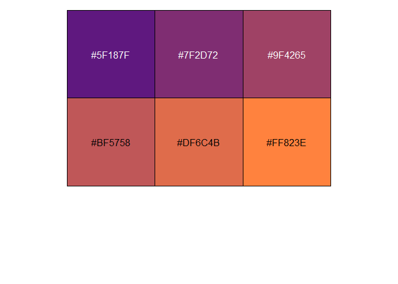

<!-- README.md is generated from README.Rmd. Please edit that file -->

# jodudr

<!-- badges: start -->
<!-- badges: end -->

The goal of `jodudr` is to collect functions I’ve found useful for data
analysis.

## Installation

You can install the development version of jodudr from
[GitHub](https://github.com/) with:

``` r
# install.packages("devtools")
devtools::install_github("JoDudding/jodudr")
```

Let’s load it and some other useful packages

``` r
library(jodudr)
library(tidyverse)
library(scales)
```

# Options

## `jo_options()`

This will set the options I use most often. Namely:

- `dplyr.width = Inf`
- `papersize = "a4"`
- `tab.width = 2`
- `width = 80`
- `max.print = 25`
- `stringsAsFactors = FALSE`
- `lubridate.week.start = 6`
- `tibble.print_max = 25`
- `tibble.print_min = 25`
- `tibble.width = Inf`
- `dplyr.summarise.inform = FALSE`
- `tidyverse.quiet = TRUE`

# Date functions

## `eom_date(d)`

This determines the last day of month n months ago:

``` r
eom_date(ymd('2022-04-19'), 13)
#> [1] "2021-03-31"
```

Used without parameters it will give the last day of the current month
(run on 2024-02-06):

``` r
eom_date()
#> [1] "2024-02-29"
```

## `friday_wk`

Get last day of the week where week ends on Friday

``` r
d <- ymd('2024-02-06') # a tuesday
friday_wk(d)
#> [1] "2024-02-09"
```

# Theming

## `jo_pal_grad(n)`

This will create a vector of n colours from my primary colour to my
secondary colour.

``` r
jo_pal_grad(6) |> 
  show_col()
```



> TODO ggplot2 theme

# Analysis helpers

## `summaryx(data, var)`

``` r
as_tibble(mtcars) |> 
  summaryx(mpg) |> 
  glimpse()
#> Rows: 1
#> Columns: 21
#> $ min      <dbl> 10.4
#> $ p1       <dbl> 10.4
#> $ p5       <dbl> 11.995
#> $ p10      <dbl> 14.34
#> $ p25      <dbl> 15.425
#> $ median   <dbl> 19.2
#> $ p75      <dbl> 22.8
#> $ p90      <dbl> 30.09
#> $ p95      <dbl> 31.3
#> $ p99      <dbl> 33.435
#> $ max      <dbl> 33.9
#> $ n_obs    <int> 32
#> $ sum      <dbl> 642.9
#> $ mean     <dbl> 20.09062
#> $ sd       <dbl> 6.026948
#> $ lci_95   <dbl> 8.278024
#> $ uci_95   <dbl> 31.90323
#> $ n_miss   <int> 0
#> $ n_zero   <int> 0
#> $ pct_miss <dbl> 0
#> $ pct_zero <dbl> 0
```

Will also work with grouping applied.

``` r
dplyr::as_tibble(mtcars) |> 
  group_by(cyl) |> 
  summaryx(mpg) |> 
  select(cyl, min, max, mean)
#> # A tibble: 3 × 4
#>     cyl   min   max  mean
#>   <dbl> <dbl> <dbl> <dbl>
#> 1     4  21.4  33.9  26.7
#> 2     6  17.8  21.4  19.7
#> 3     8  10.4  19.2  15.1
```
